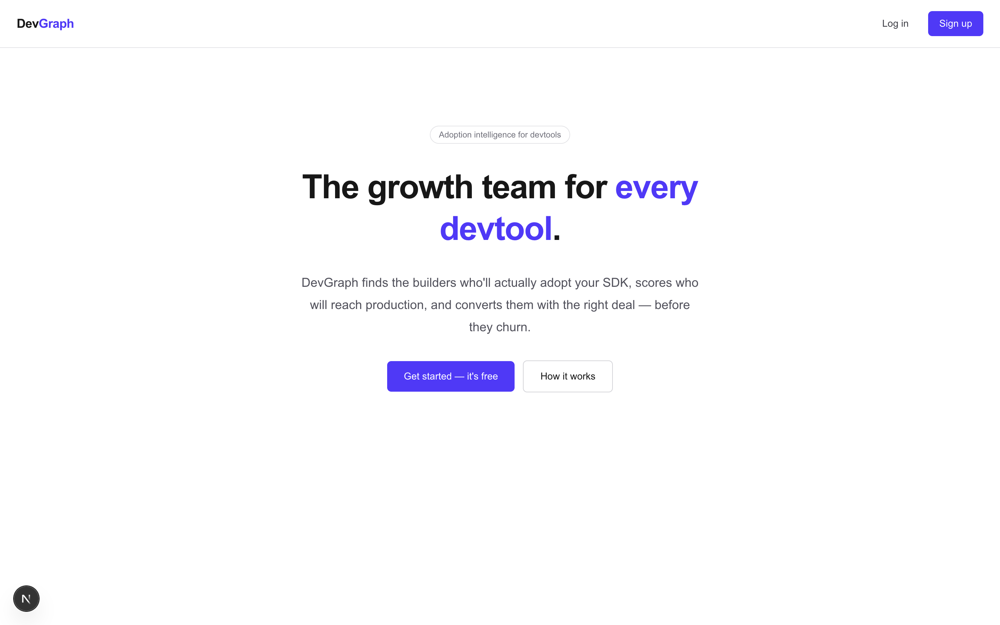
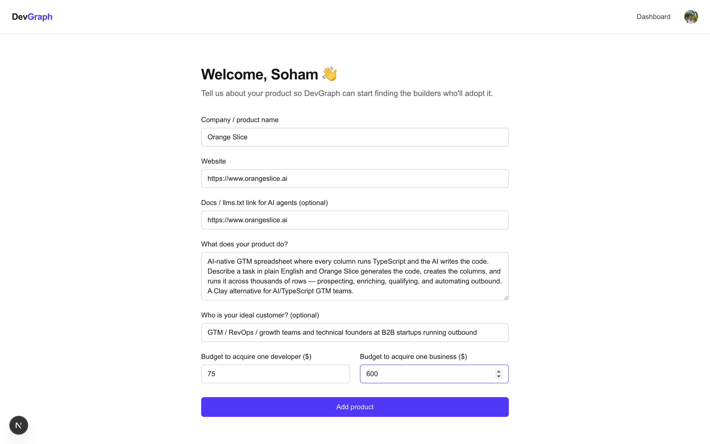
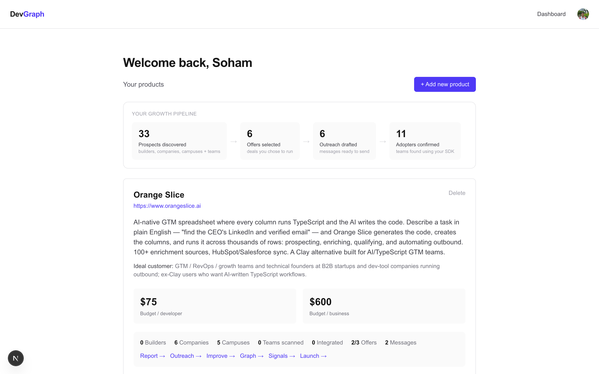
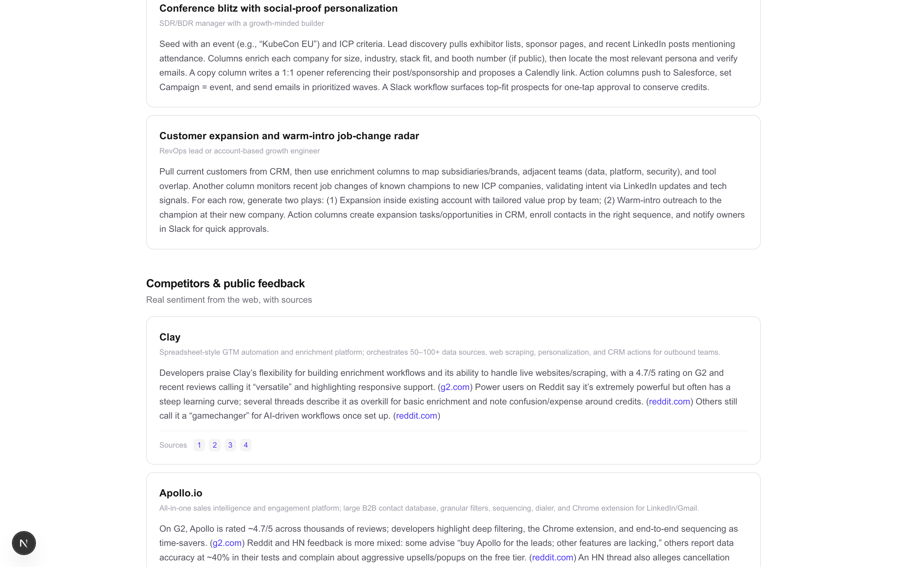
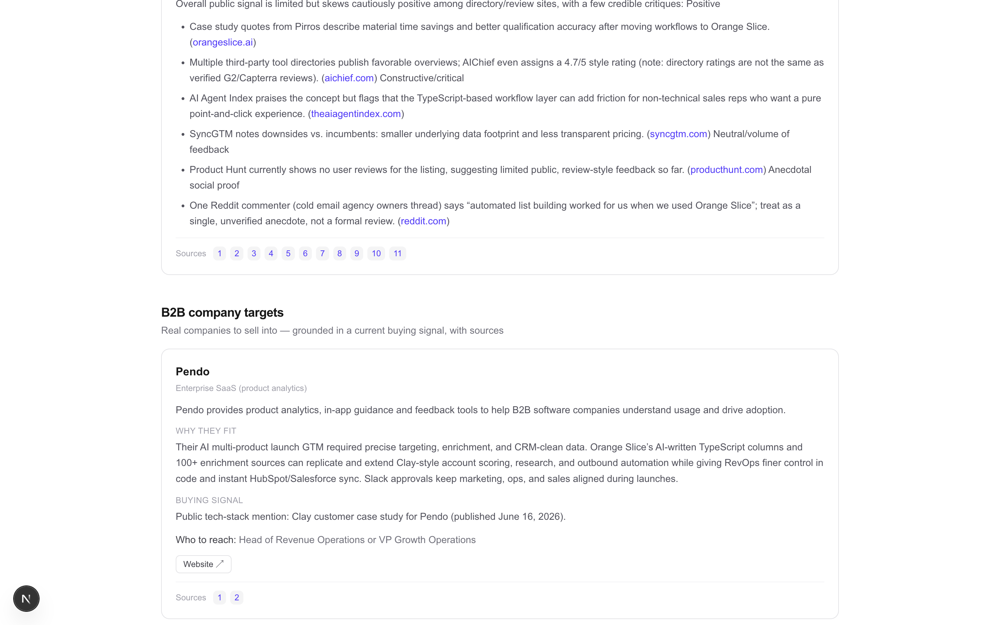
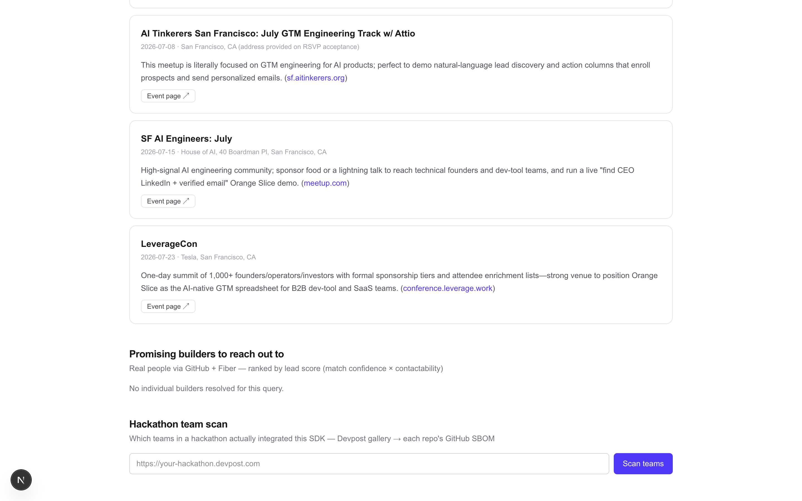
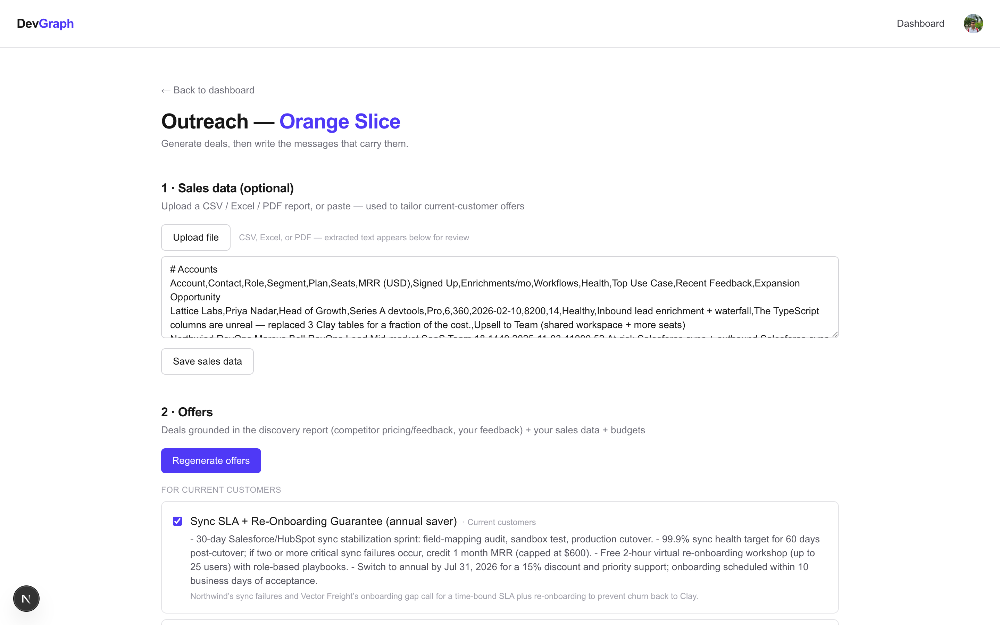
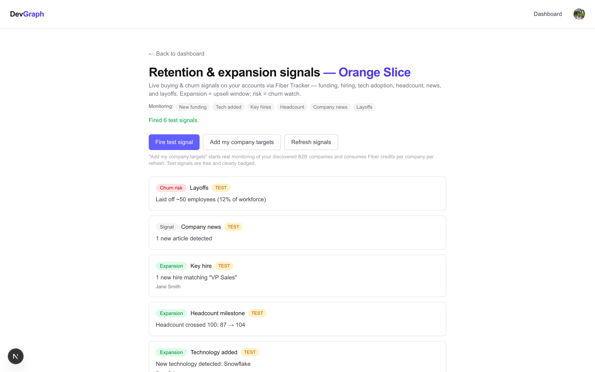
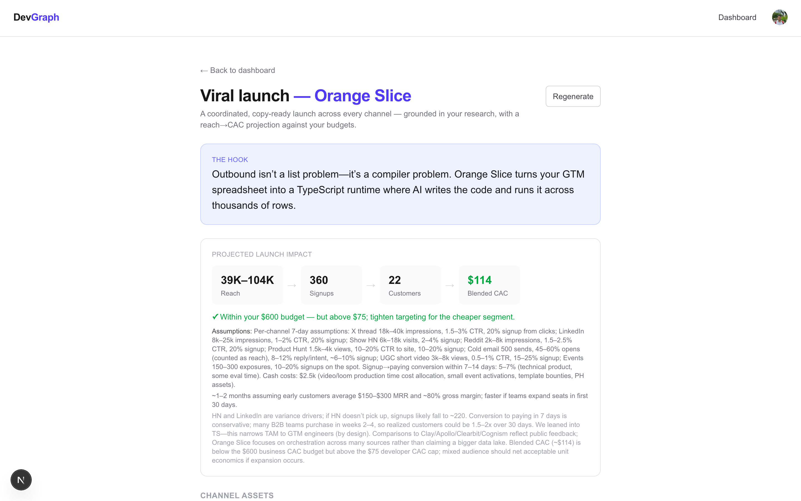

# DevGraph

**Adoption intelligence for developer-tool & API companies.** A self-serve, multi-tenant platform that runs the
whole growth loop for a product: it discovers who will adopt you (grounded in real public data), scores and
prioritizes them, drafts budget-aware offers and outreach, watches your accounts for buying/churn signals, and
even writes your launch — all from a single onboarding form.

> Built for the **YC AI Growth Hackathon by Orange Slice**. Sponsors used: **OpenAI · Convex · Fiber AI · Orange Slice**.

---

## What it does

A sponsor signs up, describes their product once (with their two CAC budgets and an optional AI-agent docs link),
and DevGraph runs the funnel:

### 1. Discovery & research — one click, grounded in **real** data (no generic LLM filler)
Reads the product's own docs first, then runs these stages concurrently, each grounded with live web search and
cited with real source URLs:
- **Buildable use cases** — what builders could ship with the product
- **Competitors + real public feedback** — actual sentiment from Reddit/HN/G2/X, with sources
- **Current customers + sentiment** — who really uses it, honestly (says "unknown" rather than inventing)
- **B2B company targets** — named companies with a *recent, dated buying signal* + who to contact, sourced
- **University & campus targets** — departments/labs/clubs/hackathons with a verified activation path
- **Upcoming events** — real dev/startup events to sponsor, dated, with URLs
- **Promising builders** — real people via the GitHub API + **Fiber** identity resolution (LinkedIn + email), with a **0–100 lead score** (match confidence × contactability)

### 2. Hackathon team SDK scan
Point it at a Devpost hackathon → scrapes the gallery → each team's GitHub repo SBOM → detects who **integrated**
your SDK vs a **competitor's** vs **none**. Plus a **tech-ecosystem graph** (co-occurrence of teams' Built-With stacks).

### 3. Offers & outreach
- **Offers** grounded in the research feedback + an uploaded **sales report** (CSV / Excel / PDF) + the CAC budgets
- **Outreach messages** (LinkedIn / X / email) — copy, request changes, and **push to Orange Slice** (button-only)

### 4. Retention & expansion signals — via **Fiber Tracker**
Watches your target accounts for **funding / hiring / tech-added / headcount / news / layoffs**, classified as
**expansion** (upsell) vs **churn risk**. Includes a free "fire test signal" for a reliable live demo.

### 5. Product improvement
AI feature suggestions grounded in real customer/competitor feedback → **share with engineering** (Orange Slice
webhook → Slack/email).

### 6. 🚀 Viral Launch-in-a-box
Generates a coordinated, copy-ready launch campaign — **X thread, LinkedIn, Show HN, Reddit, Product Hunt, cold
email, UGC video** — plus a launch-day-through-week calendar and a transparent **reach → signups → customers →
CAC** projection measured against your budgets.

### Dashboard
An account-wide **pipeline funnel** (discovered → offers → outreach → adopters) with per-product stage links.

---

## Screenshots

Captured from the running app (Orange Slice as the demo product).

| | |
|---|---|
| **Landing**<br> | **Onboarding** — one form, incl. the AI-agent docs link<br> |
| **Dashboard** — the live pipeline funnel<br> | **Discovery** — real competitors + cited public feedback<br> |
| **B2B targets** — named accounts + a dated buying signal<br> | **Scored builders** — real people via GitHub + Fiber<br> |
| **Offers & outreach** — push to Orange Slice<br> | **Retention signals** — Fiber Tracker, expansion vs churn<br> |
| **🚀 Viral launch** — hook + CAC projection<br> | **Launch assets** — copy-ready, every channel<br> |

---

## Tech stack

| Layer | Tech |
|---|---|
| Frontend | **Next.js 16** (App Router, Turbopack, React 19) — note: `middleware` is `proxy.ts` |
| Backend / DB / realtime | **Convex** — reactive queries; actions for AI/HTTP; everything tenant-scoped by Clerk identity |
| Auth | **Clerk** (`@clerk/nextjs`) — requires a JWT template named `convex` |
| AI | **OpenAI** `gpt-5` (research, offers, messages, launch) + the Responses API **web_search** tool for grounded stages |
| Data / enrichment / signals | **Fiber AI** — GitHub→LinkedIn identity resolution + **Tracker** retention signals |
| Distribution | **Orange Slice** inbound webhook (outreach + launch assets → sheet → Slack/email) |
| Public adoption signal | **GitHub API + SBOM**, **Devpost** scrape |
| UI | `react-force-graph-2d`, `react-markdown`, `xlsx` + `pdfjs-dist` (client-side file parsing) |

**Design principles:** all sends/triggers are **button-only, never automatic**. Every API key and webhook URL lives
in the Convex deployment environment — **never in code or git**.

---

## Getting started

### Prerequisites
- Node 18+, a [Convex](https://convex.dev) account, a [Clerk](https://clerk.com) app, and an OpenAI key.
- Optional: Fiber AI key (builders + retention signals), an Orange Slice sheet webhook, a GitHub token.

### 1. Install
```bash
npm install
```

### 2. Configure the backend (Convex deployment env)
```bash
npx convex env set OPENAI_API_KEY sk-...
npx convex env set FIBER_API_KEY ...                      # builders + retention signals (optional)
npx convex env set ORANGE_SLICE_WEBHOOK_URL https://...   # outreach + launch push (optional)
npx convex env set ORANGE_SLICE_ENG_WEBHOOK_URL https://... # share-with-engineering (optional)
npx convex env set GITHUB_TOKEN ghp_...                   # higher GitHub rate limit (optional)
```
Set your Clerk JWT issuer domain in [`convex/auth.config.ts`](convex/auth.config.ts).

### 3. Configure the frontend (`.env.local`)
```bash
NEXT_PUBLIC_CONVEX_URL=https://<your-deployment>.convex.cloud
NEXT_PUBLIC_CLERK_PUBLISHABLE_KEY=pk_...
CLERK_SECRET_KEY=sk_...
```

### 4. Run
```bash
npx convex dev      # backend (keep running; deploys functions + schema)
npm run dev         # frontend at http://localhost:3000
```

Sign in → **/onboarding** (add a product) → **/dashboard** → Begin research → drive each stage from the product's
links: **Report · Outreach · Improve · Graph · Signals · Launch**.

---

## Project structure

```
convex/                 # backend (the system of record)
  schema.ts             # tables: products, reports, offers, outreachMessages,
                        #         featureReports, hackathonScans, signals, launchCampaigns
  validators.ts         # shared Convex validators (also mirror the LLM JSON schemas)
  research.ts           # discovery pipeline (parallel, web-grounded stages)
  outreach.ts           # offers + messages + Orange Slice push
  improve.ts            # feature suggestions + share-with-engineering
  hackathon.ts          # Devpost scrape -> GitHub SBOM -> SDK detection
  tracker.ts            # Fiber Tracker retention/expansion signals
  launch.ts             # Viral Launch-in-a-box generator
  dashboard.ts          # account pipeline-funnel rollup
  openai.ts             # shared OpenAI helpers
src/
  app/                  # App Router pages: onboarding, dashboard, report, outreach,
                        #   improve, graph, signals, launch
  components/           # onboarding form, product list / pipeline, markdown
  lib/parse-file.ts     # client-side CSV / Excel / PDF text extraction
  proxy.ts              # Clerk route protection (Next 16 renamed middleware)
```

> ⚠️ This uses **Next.js 16**, which has breaking changes vs the Next.js you may know — see `AGENTS.md` and read
> the bundled docs in `node_modules/next/dist/docs/` before changing routing/middleware.
